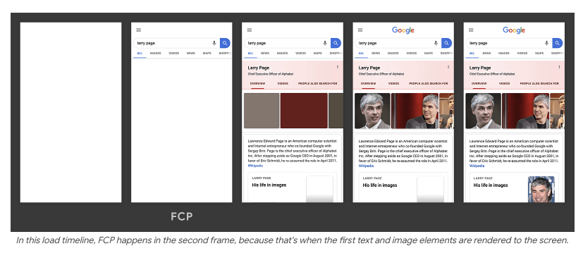

# FCP, which stands for First Contentful Paint.

## Definition:

FCP measures the time from when the user first navigated to the page to when any part of the page's content is rendered on the screen.

Content can include things like:

* Text
* Images
* SVGs
* Non-white canvas elements

## Metrics:

A good FCP score <= 1.8 secs for at least 75% of the users.

## How to measure FCP?

FCP can be measured using:

* **web-vitals JavaScript library**
* **Lighthouse**
* **Chrome DevTools**

Lighthouse is very useful because It also lists what optimizations can help improve your FCP score. 

## How to improve FCP?

1. Minify CSS
2. Remove unused CSS
3. Remove unused JavaScript
4. Reduce TTFB

There are many more ways that are listed in the article.

Lighthouse also shows the **approximate number of bytes that can be saved** by applying these optimizations

> FCP is not a core web vital because a low FCP does not mean that the user can start using the website , but it is extremely important because LCP depends on it, which is a core web vital.

## Resources:

* [First Contentful Paint (FCP) — web.dev](https://web.dev/articles/fcp)

