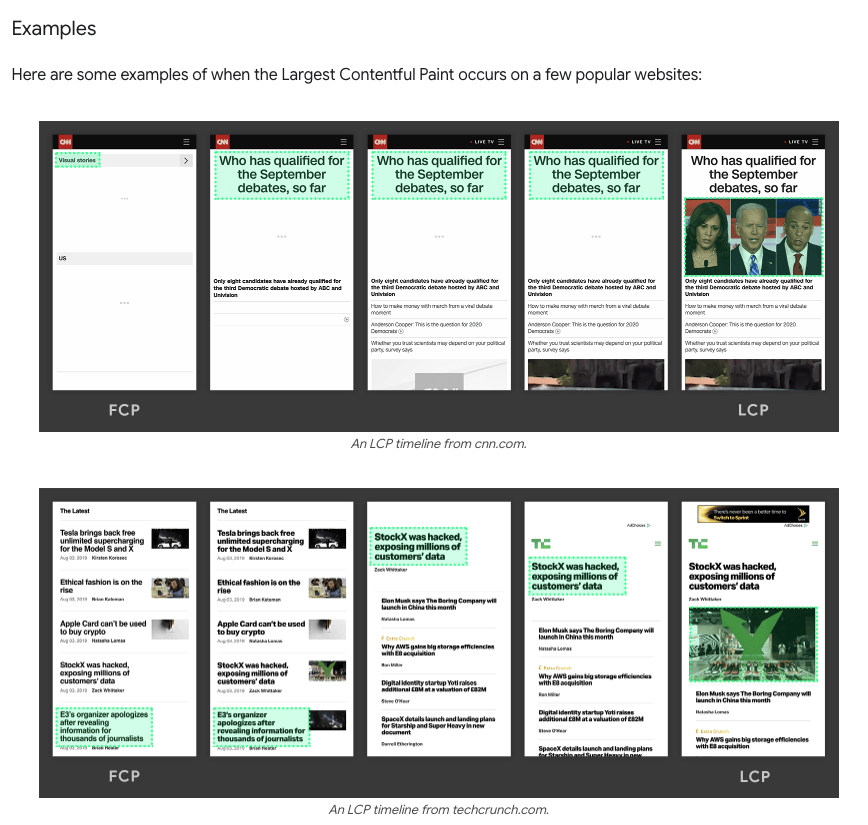

# LCP, which stands for Largest Contentful Paint.

## Definition:

LCP is the time taken to render the largest element in the viewport, relative to the time when the user first navigated to the web page. This largest element could be text, an image, or a video

## Score:

A good LCP score is ≤ 2.5 seconds for at least 75% of the users.

## Difference between LCP and FCP:

LCP only considers a subset of elements to be considered in the largest element rendered. These elements are:

1. the `img` tag
2. an `image` inside an `svg` tag
3. a `url` element
4. a `video` element
5. a text node

SVGs are not considered for LCP due to complexities in measuring the LCP time. However, for FCP, all types of elements are considered.

> FCP may be calculated, even when the website shows a splash or loading screen, while LCP is measured for the largest content in the viewport. LCP is more useful because FCP tells the user that something is loading, but LCP tells the user that the website is now usable.

## FCP can be measured using:

* **web-vitals JavaScript library**
* **Lighthouse**
* **Chrome DevTools**

## Optimising LCP

TBD - https://web.dev/articles/optimize-lcp

## Resources

https://web.dev/articles/lcp
